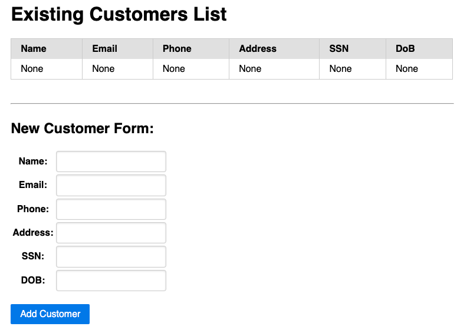
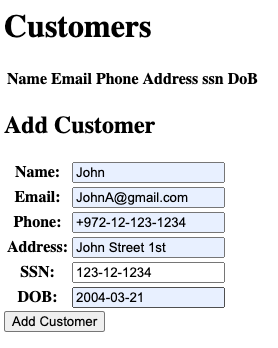
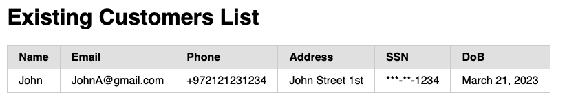

<p>
  <a href="https://piiano.com/pii-data-privacy-vault/">
    <picture>
      <source media="(prefers-color-scheme: dark)" srcset="https://piiano.com/docs/img/logo-developers-dark.svg">
      <source media="(prefers-color-scheme: light)" srcset="https://piiano.com/wp-content/uploads/piiano-logo-developers.png">
      
    </picture>
  </a>
</p>

# Django-encryption-example

## About
The sample has been built using the Django web framework and utilizes the [orm-django](../../sdk/orm-django) to interact with the underlying database. The sample website has several features, including the ability to create and manage users.

As this sample utilizing Piiano vault's features, we are enabled to encrypt / decrypt personal information such as SSN.

## Requirements
Running this example requires `Python3`, `Docker` and `PIP`.

## Running the example

1. Clone the repo
1. In a terminal, change directory to `examples/django-encryption-example`
1. There are two options for running this example: automatic and manual

### Automatically running the example
```commandline
./run.sh
```

### Manually running the example

**TBD still**

Run the following:
```commandline
pip install django-encryption
```

Create a local_settings.py, you can just copy local_settings_example.py to local_settings.py locally

**Make sure you have a local copy of vault running** then run the following commands:

```python
python manage.py migrate
python manage.py generate_vault_migration > vault_migration.py
python vault_migration.py
python manage.py runserver
```

## Application Website

**TBD - Missing URL**
After running the project, the website looks like this:



We can add a customer by filling the fields for each property (and press "Add customer") like:



Then a new customer will appear with the given values:


