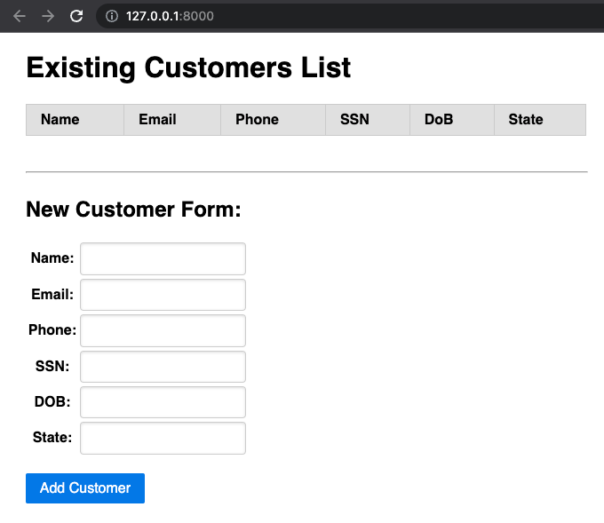
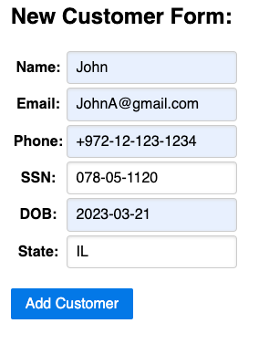
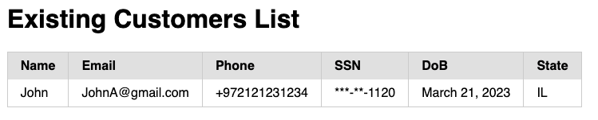

<p>
  <a href="https://piiano.com/pii-data-privacy-vault/">
    <picture>
      <source media="(prefers-color-scheme: dark)" srcset="https://docs.piiano.com/img/logo-developers-dark.svg">
      <source media="(prefers-color-scheme: light)" srcset="https://docs.piiano.com/img/logo-developers.svg">
      
    </picture>
  </a>
</p>

# Django-encryption-example

## About
The sample has been built using the Django web framework and utilizes the [orm-django](../../sdk/orm-django) to interact with the underlying database. The sample website has several features, including the ability to create and manage users.

As this sample utilizing Piiano vault's features, we are enabled to encrypt / decrypt personal information such as SSN.

## Requirements
Running this example requires `Python3`, `Docker` and `PIP`.

## Running the example

1. Clone the repo
1. In a terminal, change directory to `examples/django-encryption-example`
1. There are two options for running this example: automatic and manual

### Automatically running the example
```commandline
./run.sh
```

### Manually running the example

1. Run the following:
    ```commandline
    pip install django-encryption
    ```
1. Create the `local_settings.py` file. You can start by copying [`local_settings_example.py`](./vault_sample_django/local_settings_example.py) and using it as-is.
1. Ensure you have a local instance of vault running. Running Vault requires a license that could be obtained in the [getting started](https://piiano.com/docs/guides/get-started) section. It also explains how to run the Vault with a single container.
1. Run the following:
    ```commandline
    python manage.py migrate
    python manage.py generate_vault_migration > vault_migration.py
    python vault_migration.py
    python manage.py runserver
    ```

## Application Website

After running the project, navigate to the Django web application over [http://localhost:8000](http://localhost:8000)



We can add a customer by filling the fields for each property (and press "Add customer") like:



Then a new customer will appear with the given values:


